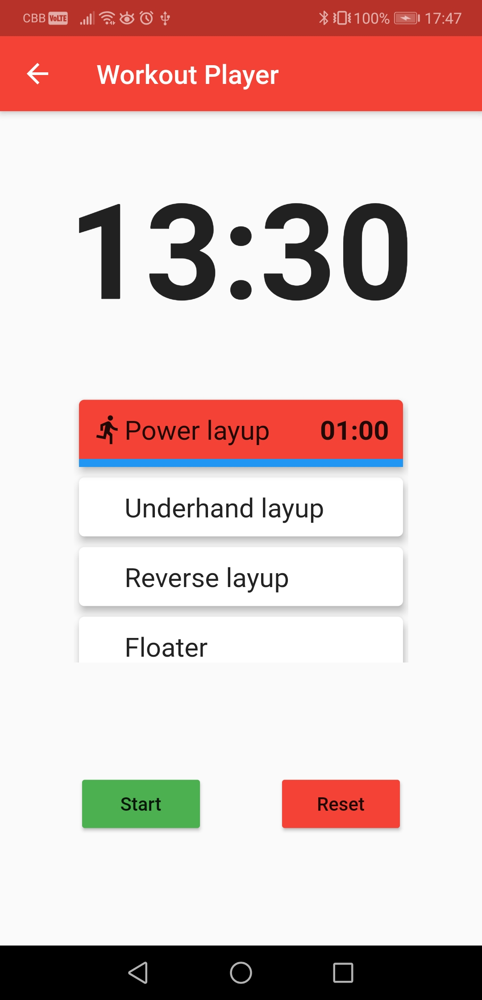
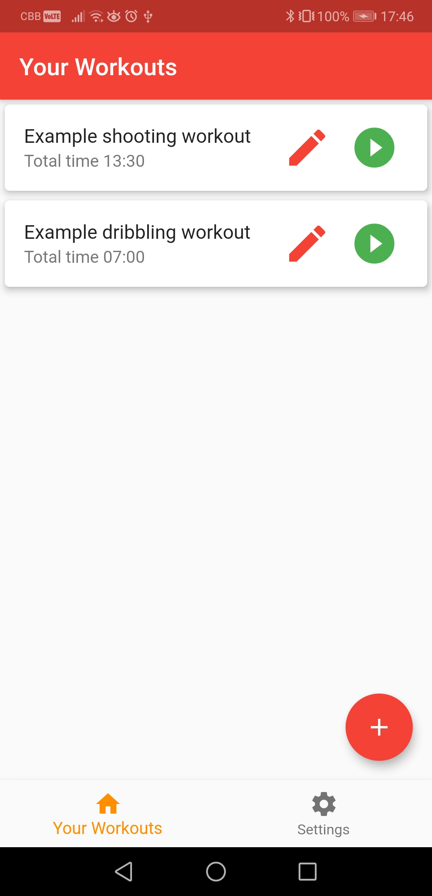
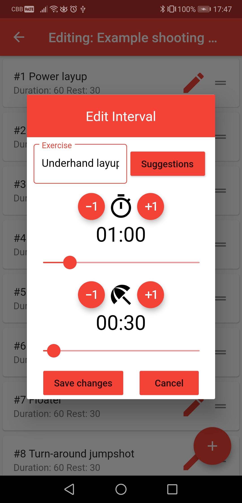
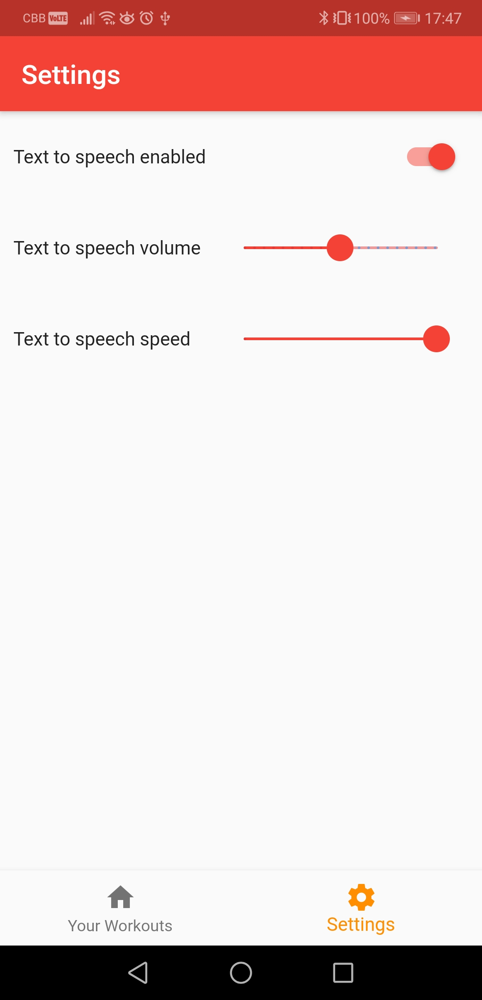

# Basketball Interval Training

A basketball workout creator app that allows you to design your own interval-based basketball workouts. Using text-to-speech, it will notify you of the next basketball move in your routine.

The app follows a Model-View-ViewModel (MVVM) architecture, utilizes the sqflite package for local workout storage, and retrieves exercise suggestions from a Firebase database.

# Demo Pictures

